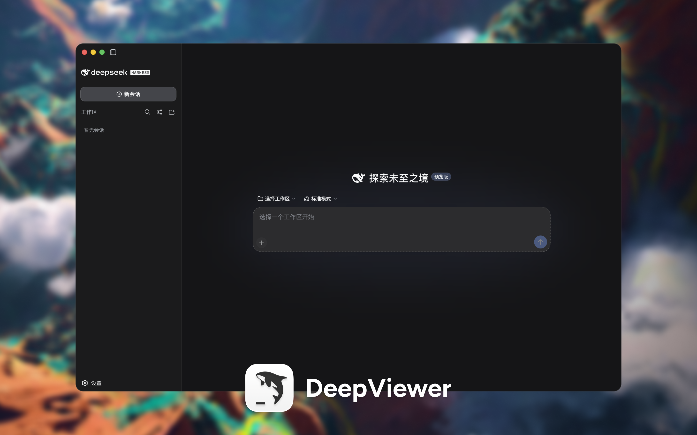

<p align="center">
  
</p>

<h1 align="center">DeepViewer</h1>

<p align="center">
  A visual, controllable, and customizable desktop workspace for DeepSeek Harness.
</p>

<p align="center">
  <a href="https://github.com/Duoasa/DeepViewer/releases"></a>
  
  
  <a href="LICENSE"></a>
</p>

<p align="center">
  <a href="https://github.com/Duoasa/DeepViewer/releases/tag/v0.1.1"><strong>Download DeepViewer v0.1.1</strong></a>
  ·
  <a href="#whats-new-in-011">What's new</a>
  ·
  <a href="#privacy-by-design">Privacy</a>
  ·
  <a href="#build-and-test">Build from source</a>
</p>

<p align="center">
  <strong>English</strong> · <a href="README.zh-CN.md">简体中文</a>
</p>

<p align="center">
  
</p>

DeepViewer is an independent, open-source desktop agent workspace built on
[DeepSeek Harness](https://github.com/deepseek-ai/deepseek-harness). It bundles
the pinned local runtime into a normal macOS application and provides a desktop
shell designed for a visual, controllable agent experience.

> [!NOTE]
> DeepViewer is a community project. It is not affiliated with or endorsed by
> DeepSeek.

> [!IMPORTANT]
> `v0.1.1` is an unsigned macOS UI preview. It has passed the maintainer's
> initial visual acceptance, but it is not a signed, notarized, or stable release.

## Why DeepViewer

| | |
| --- | --- |
| **Desktop first** | Launch the agent as a normal macOS application without manually running Node, npm, pnpm, or a Web UI command. |
| **Self-contained runtime** | Ships the pinned Harness runtime and compatible execution environment inside the application. |
| **Native Mac packages** | Provides separate arm64 and x64 packages for Apple Silicon and Intel Macs. |
| **Integrated macOS shell** | Uses native traffic lights inside the application, a full-width drag region, and a Codex-style collapsible sidebar. |
| **Local by default** | Runs Harness on a random `127.0.0.1` port and does not expose the service to the LAN. |
| **Controlled lifecycle** | Starts, health-checks, monitors, retries, and stops Harness together with the desktop application. |
| **Clean public artifacts** | Rebuilds each public package from allowlisted inputs and blocks releases containing developer paths, settings, or credential values. |
| **Spec driven** | Keeps product intent, architecture, implementation tasks, and verification evidence in a committed SDD system. |

## Quick start

1. Download the package that matches your Mac from the
   [v0.1.1 release](https://github.com/Duoasa/DeepViewer/releases/tag/v0.1.1).
2. Open the DMG and copy `DeepViewer.app` to Applications.
3. Open DeepViewer. It starts the bundled Harness automatically and loads the
   local workspace when the runtime is ready.

| Mac | Download | SHA-256 |
| --- | --- | --- |
| Apple Silicon (`arm64`) | [DeepViewer-0.1.1-macos-arm64.dmg](https://github.com/Duoasa/DeepViewer/releases/download/v0.1.1/DeepViewer-0.1.1-macos-arm64.dmg) | `3eea789d36458272cee469a80167d09badb1abea1723abd88f118da465d406b9` |
| Intel (`x64`) | [DeepViewer-0.1.1-macos-x64.dmg](https://github.com/Duoasa/DeepViewer/releases/download/v0.1.1/DeepViewer-0.1.1-macos-x64.dmg) | `f7b70f7fcdf8641f7228a2df42242e444688b8ac3ec1865c27029be9624dd561` |

The release also includes a
[`SHA256SUMS.txt`](https://github.com/Duoasa/DeepViewer/releases/download/v0.1.1/SHA256SUMS.txt)
manifest for command-line verification.

> [!WARNING]
> These preview packages are not signed or notarized by Apple. macOS may block
> the first launch. If you trust this repository and downloaded the package from
> the official release above, use Finder's **Open** action or allow the app in
> **System Settings → Privacy & Security**.

## What's new in 0.1.1

<p align="center">
  
</p>

- Integrated the native macOS traffic lights into the app surface and removed
  the separate system title bar.
- Added a Codex-style sidebar control beside the traffic lights. Collapsing now
  hides the entire sidebar, and the control moves left when native fullscreen
  hides the traffic lights.
- Reserved a full-width top safe area so window controls, page actions, and the
  draggable region do not overlap.
- Unified the application name and Dock identity as `DeepViewer`, using the
  maintainer-provided macOS 26 icon.
- Added a centered DeepViewer startup surface with a blinking cursor line and a
  separate plugin-loading surface with a stable logo and `Loading Plugins...`
  text shimmer.
- Added release privacy gates: every public architecture is rebuilt from a clean
  runtime and allowlist staging directory, then audited before its DMG is created.
- Generated fresh, architecture-specific arm64 and x64 DMGs for 0.1.1.

## Current limitations

- The packages are unsigned and not notarized, so Gatekeeper warnings are expected.
- The x64 build passes architecture, package, and Rosetta-based validation on
  Apple Silicon; physical Intel Mac acceptance remains pending.
- DeepViewer currently customizes the desktop shell around the upstream Harness
  workspace. More navigation, onboarding, and differentiated agent features are
  planned.
- Windows packaging, automatic updates, crash reporting, and a stable support
  policy are not included in this preview.
- The complete bundled runtime keeps each DMG large; runtime size optimization is
  deferred until the product path is stable.

## Privacy by design

- Harness listens only on a randomly assigned loopback address.
- The desktop window rejects unexpected navigation and new windows.
- Harness telemetry is disabled by the desktop launch configuration.
- The Renderer receives only an allowlisted desktop bridge; it does not receive
  general shell or filesystem access.
- Logs redact common authorization headers, API-key assignments, and secret-like
  values.
- Public packages are created from a clean allowlist staging directory. The build
  removes package-manager workspace metadata and blocks developer home paths,
  personal settings files, and current environment credential values.
- DeepViewer does not add the developer's or maintainer's local sessions,
  workspace, logs, settings, or API credentials to release assets.

## Requirements

For the prebuilt application:

- A Mac with Apple Silicon or an Intel processor.
- No global Node.js, npm, pnpm, or DeepSeek Harness installation is required.
- Because this is an unsigned preview, the user must explicitly approve the first
  launch through macOS security controls.

For development:

- Node.js 24 or later.
- pnpm 11.19.0.
- The pinned DeepSeek Harness checkout described below.

## Build and test

```sh
git clone https://github.com/Duoasa/DeepViewer.git
cd DeepViewer
pnpm install

git clone https://github.com/deepseek-ai/deepseek-harness upstream/deepseek-harness
git -C upstream/deepseek-harness checkout 47f943859bef60e4160492346772ded9b24f765a
pnpm --dir upstream/deepseek-harness install
pnpm --dir upstream/deepseek-harness run build
pnpm --dir upstream/deepseek-harness run release:pack --family vendor --out dist/deepviewer/vendor
pnpm --dir upstream/deepseek-harness run release:pack --family dsh --out dist/deepviewer/dsh

pnpm typecheck
pnpm test
pnpm desktop:build
pnpm desktop:package:arm64
pnpm desktop:package:x64
```

Generated applications, runtimes, and DMGs are written below `out/` and
`.runtime/`. They are build outputs and are intentionally excluded from Git.

## Spec-Driven Development

DeepViewer's [SDD documentation system](docs/sdd/README.md) is the source of
truth for product baselines, architecture decisions, specifications, tasks,
verification, release privacy rules, and public artifact evidence.

## License and upstream

DeepViewer's original code is released under the [MIT License](LICENSE).
DeepSeek Harness and all third-party components retain their respective
copyright notices and licenses. The current desktop baseline is pinned to
DeepSeek Harness commit
`47f943859bef60e4160492346772ded9b24f765a` (`0.1.0-rc.5`).

## Feedback

Bug reports, Intel compatibility results, and focused feature proposals are
welcome in [GitHub Issues](https://github.com/Duoasa/DeepViewer/issues). Never
include API keys, credentials, private workspace content, or unredacted logs in
an issue.
