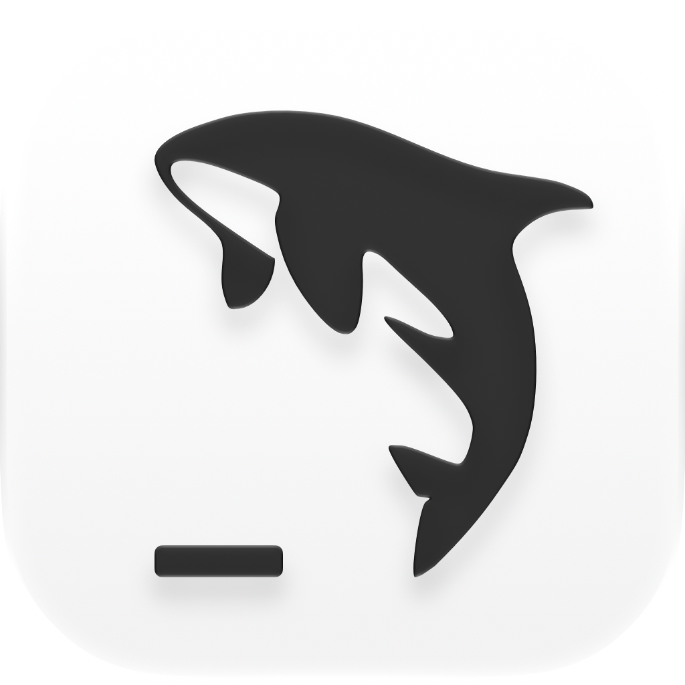
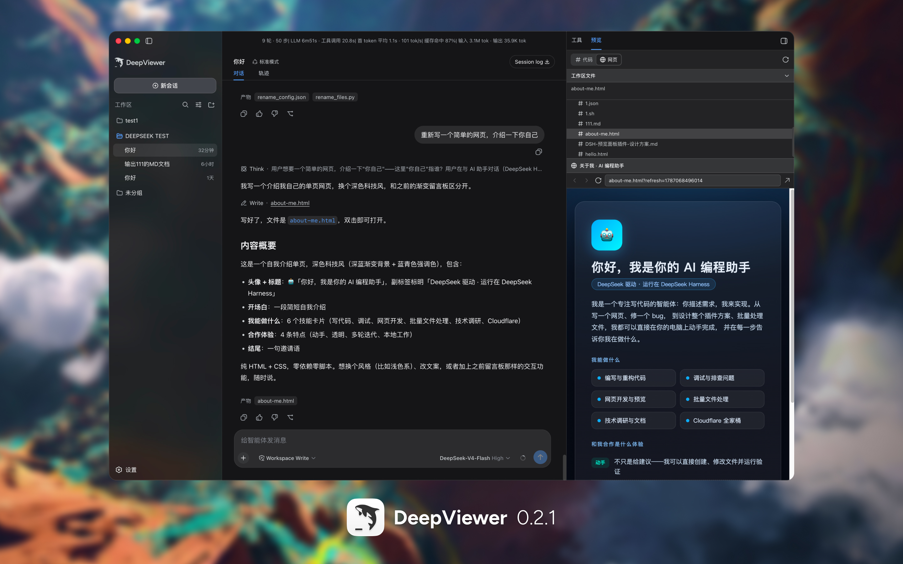
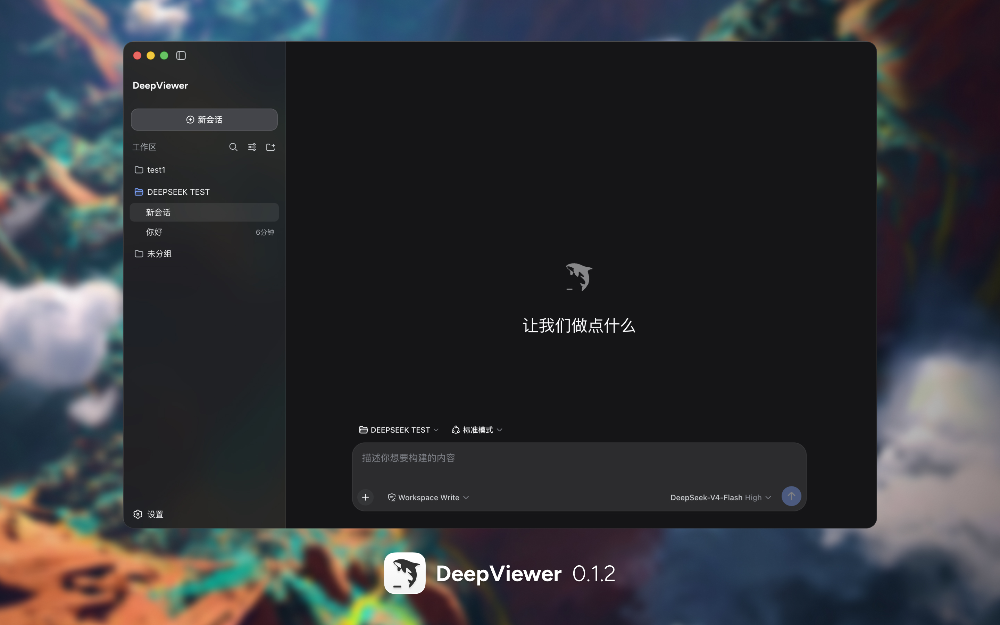
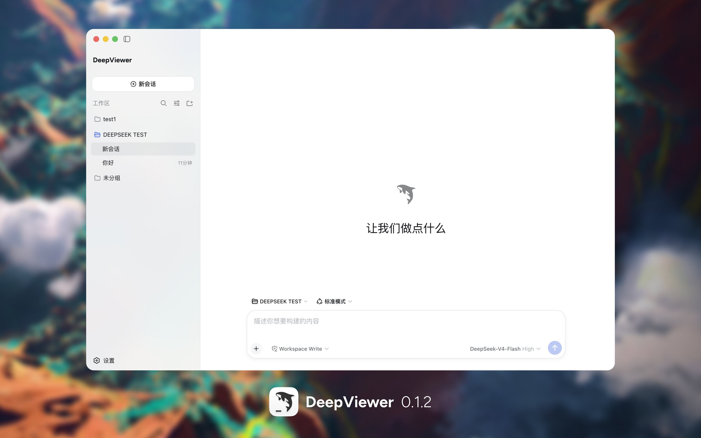
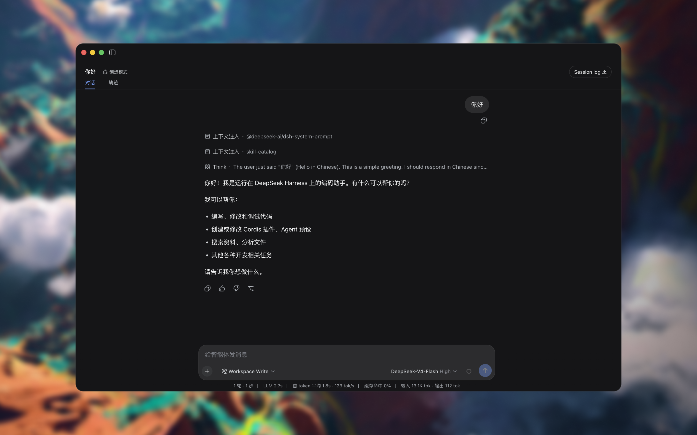

<p align="center">
  
</p>

<h1 align="center">DeepViewer</h1>

<p align="center">
  A visual, controllable, and customizable desktop workspace for DeepSeek Harness.
</p>

<p align="center">
  <a href="https://github.com/Duoasa/DeepViewer/releases"></a>
  <a href="https://github.com/Duoasa/DeepViewer/actions/workflows/ci.yml"></a>
  
  
  <a href="LICENSE"></a>
  <a href="https://github.com/deepseek-ai/deepseek-harness/discussions/2828"></a>
</p>

<p align="center">
  <a href="https://github.com/Duoasa/DeepViewer/releases/tag/v0.2.2-build.2"><strong>Download DeepViewer 0.2.2 (Build 2)</strong></a>
  ·
  <a href="#whats-new-in-022">What’s new</a>
  ·
  <a href="#privacy-by-design">Privacy</a>
  ·
  <a href="#build-and-test">Build from source</a>
</p>

<p align="center">
  <strong>English</strong> · <a href="README.zh-CN.md">简体中文</a>
</p>

DeepViewer is an independent, open-source desktop agent workspace built on
[DeepSeek Harness](https://github.com/deepseek-ai/deepseek-harness). It bundles
the pinned local runtime into a normal macOS application and provides a desktop
shell designed for a visual, controllable agent experience.

<p align="center">
  
</p>

> [!NOTE]
> DeepViewer is a community project. It is not affiliated with or endorsed by
> DeepSeek.

> [!IMPORTANT]
> `v0.2.2-build.2` is the latest macOS preview (app version `0.2.2`, build `2`) and
> bundles DeepSeek Harness `0.1.0-rc.8`. It preserves the maintainer-accepted
> 0.2.1 interface, prevents rc.8 from opening a second system-browser window,
> and has passed the automated gates. rc.8
> subscription account flows remain a maintainer check, and this is still an
> early preview rather than a stable release.

## Why DeepViewer

| | |
| --- | --- |
| **Desktop first** | Launch the agent as a normal macOS application without manually running Node, npm, pnpm, or a Web UI command. |
| **Self-contained runtime** | Ships the pinned Harness runtime and compatible execution environment inside the application. |
| **Native Mac packages** | Provides separate arm64 and x64 packages for Apple Silicon and Intel Macs. |
| **Integrated macOS shell** | Uses native traffic lights inside the application, a full-width drag region, and a Codex-style collapsible sidebar. |
| **Local by default** | Runs Harness on a random `127.0.0.1` port and does not expose the service to the LAN. |
| **Controlled lifecycle** | Starts, health-checks, monitors, retries, and stops Harness together with the desktop application. |
| **Clean public artifacts** | Rebuilds each public package from allowlisted inputs and blocks releases containing developer paths, settings, or credential values. |
| **Spec driven** | Keeps product intent, architecture, implementation tasks, and verification evidence in a committed SDD system. |

## Quick start

1. Download the package that matches your Mac from the
   [0.2.2 Build 2 release](https://github.com/Duoasa/DeepViewer/releases/tag/v0.2.2-build.2).
2. Open the DMG and copy `DeepViewer.app` to Applications.
3. Open DeepViewer. It starts the bundled Harness automatically and loads the
   local workspace when the runtime is ready.

| Mac | Download | SHA-256 |
| --- | --- | --- |
| Apple Silicon (`arm64`) | Build 2 packaging in progress | Pending |
| Intel (`x64`) | Build 2 packaging in progress | Pending |

The release also includes a
`SHA256SUMS.txt`
manifest for command-line verification.

## What's new in 0.2.2

### Build 2 browser-launch hotfix

- Prevents rc.8's `dsh web` default from opening the system browser when
  DeepViewer starts. The local Harness page is loaded only by the application.
- Applies `--no-open` to the core, subscriptions-only, preview-enabled, and
  core fallback launch paths without changing loopback binding or permissions.
- Keeps the original `v0.2.2` Build 1 release unchanged as a rollback option.

### DeepSeek Harness rc.8

- Upgrades the only bundled core to the immutable DeepSeek Harness
  `0.1.0-rc.8` release (`141eb6fef83422698aef7a981029e843e8161534`).
- Brings upstream multimodal and image-input improvements, file/session
  references, installable Claude and Codex subagent bundles, persistent
  PowerShell, concurrent web search, subagent wakeups, and startup/download
  refinements into the pinned local Runtime.
- Includes upstream fixes for image payloads, stream cancellation, custom
  OpenAI-compatible gateways, search, tool rendering, and UI layout.

### Compatibility and data safety

- Revalidates `dsh-plugin-subscriptions@0.3.1` and
  `@deepviewer/dsh-plugin-preview@0.1.0` against rc.8. The preview plugin now
  pins rc.8 peers and builds through the rc.8 host/client contract without
  widening desktop filesystem or network privileges.
- Keeps the default DeepViewer session backend on JSONL, so ordinary 0.2.1
  installations do not undergo a storage migration. rc.8's optional SQLite
  backend uses schema 17 and has no migration from the earlier pre-release
  schema; custom SQLite users should retain their database and either start a
  new rc.8 database or reinstall 0.2.1 to read the old one.
- Preserves the immutable signed bundle, plugin disable/fallback paths, and the
  existing 0.2.1 Release as a rollback option.

### Release quality

- Rebuilds independent arm64 and x64 Runtimes from the official rc.8
  release-pack. Each application contains one pinned Harness and the same two
  registered plugins.
- Runs the complete upstream official build, 105 desktop tests, TypeScript and
  desktop production builds, package privacy audits, strict Developer ID
  signing, Apple notarization, ticket stapling, Gatekeeper and DMG verification.

See the [`0.2.2 Build 2` release record](docs/sdd/releases/v0.2.2-build.2.md) for the complete
asset and verification evidence. The 0.2.2 core-only update preserves the 0.2.1
interface shown in the current product image above.

## What's new in 0.2.1

### DeepSeek Harness rc.7 and plugin governance

- Upgrades the only bundled core to DeepSeek Harness `0.1.0-rc.7`; the About
  page reports the app version, build number, and active core version together.
- Introduces a committed DSH plugin registry. Every future core update must
  recheck the source, pinned version, peer graph, client injection points,
  capabilities, security boundaries, fallback behavior, and packaged Runtime
  for every active plugin.
- Keeps the signed application immutable: plugins are pinned at build time and
  never download into or modify `Contents/Resources/harness` at runtime.

### Subscriptions inside Models

- Integrates `dsh-plugin-subscriptions@0.3.1` through official DSH bundle and
  client extension points rather than a private model protocol.
- Reorganizes Models into an API section followed by Subscriptions, separated
  with the same visual divider used by Settings.
- Supports localized external-browser sign-in and provider status. Remaining
  quota fills the usage bar directly, changes color at healthy/warning/critical
  thresholds, and uses the provider-neutral “period window” label.
- A real subscription login was manually validated. Provider model/tool calls
  and logout remain explicit compatibility checks because the external services
  do not expose stable public protocols.

### Code and static web preview

- Adds a first-party `@deepviewer/dsh-plugin-preview@0.1.0` right sidebar with a
  workspace file tree, read-only syntax-highlighted code, and isolated static
  web preview.
- Opens at one third of the current window, supports direct border resizing,
  and exposes a fixed top-right toggle that respects the macOS safe area.
- Provides collapsible workspace files, draggable vertical section sizing, and
  a compact browser toolbar with back, forward, refresh, constrained address
  navigation, and system-browser handoff.
- Restricts preview access to registered workspaces. Path traversal, symlink
  escapes, sensitive files, binaries, oversized files, expired capabilities,
  and arbitrary development-server URLs are rejected.

### Faster artifact workflow and refined desktop shell

- Agent-generated files now open in DeepViewer Preview on a normal click.
  Native context menus add “Preview in DeepViewer”, “Show in Finder”, and copy
  path actions while retaining the original Host fallback.
- Settings is now a full-window application page with a stable two-column
  layout and an About DeepViewer destination.
- Refreshes the native SVG wordmark, welcome composition, 120px startup mark,
  light/dark contrast, and manual-only left/right sidebar controls.

### Release quality

- Rebuilds independent arm64 and x64 Runtimes from the rc.7 release-pack. Each
  application contains exactly one Harness and the same two pinned plugins.
- Both DMGs passed allowlist and credential-value privacy audits, strict nested
  code-sign verification, Apple notarization, ticket stapling, Gatekeeper,
  architecture inspection, and independent post-upload SHA-256/DMG verification.

See the [`0.2.1` release record](docs/sdd/releases/v0.2.1.md) for the complete
asset and verification evidence.

## What's new in 0.1.2

<p align="center">
  
  
</p>

- Restructured the macOS window as two visual columns—sidebar and Chat—with
  structural safe areas inside each column instead of a separate full-width bar.
- Moved model usage statistics into the centered Chat safe area and fixed the
  composer to the same 32px bottom baseline in new, thinking, streaming, and
  completed states.
- Added a full-Chat-canvas welcome surface with a 48px half-opacity animated
  DeepViewer mark and the localized “What shall we build?” headline.
- Refined the inline sidebar wordmark, native focused-window material, solid
  unfocused state, light/dark fade continuity, fixed sidebar toggle, and native
  control readability.
- Added tracked upstream UI overrides with deterministic sync/build checks, plus
  isolated development, local ARM preview, and explicit release workflow tiers.
- Build 2 added a restricted system-browser handoff for HTTP(S) links and native
  “Show in Finder” and copy-path actions for local deliverables.
- Rebuilt separate arm64 and x64 DMGs from allowlisted inputs. Both packages are
  Developer ID signed, Apple-notarized, stapled, privacy-audited, and published
  with reproducible SHA-256 checksums.

See the [`0.1.2` release record](docs/sdd/releases/v0.1.2.md) and
[`v0.1.2-build.2` release](https://github.com/Duoasa/DeepViewer/releases/tag/v0.1.2-build.2)
for the complete asset and verification evidence.

## What's new in 0.1.1

<p align="center">
  
</p>

- Integrated the native macOS traffic lights into the app surface and removed
  the separate system title bar.
- Added a Codex-style sidebar control beside the traffic lights. Collapsing now
  hides the entire sidebar, and the control moves left when native fullscreen
  hides the traffic lights.
- Reserved a full-width top safe area so window controls, page actions, and the
  draggable region do not overlap.
- Unified the application name and Dock identity as `DeepViewer`, using the
  maintainer-provided macOS 26 icon.
- Added a centered DeepViewer startup surface with a blinking cursor line and a
  separate plugin-loading surface with a stable logo and `Loading Plugins...`
  text shimmer.
- Added release privacy gates: every public architecture is rebuilt from a clean
  runtime and allowlist staging directory, then audited before its DMG is created.
- Generated fresh, architecture-specific arm64 and x64 DMGs for 0.1.1. Both
  packages are Developer ID signed and passed Apple notarization.

## Current limitations

- The x64 build passes architecture, package, and Rosetta-based validation on
  Apple Silicon; physical Intel Mac acceptance remains pending.
- Subscription providers use external, non-stable protocols. Login has been
  manually validated on 0.2.1; the complete login, status, model/tool call and
  logout flow remains a provider-specific 0.2.2 check.
- rc.8's optional SQLite session backend cannot read the earlier pre-release
  schema in place. DeepViewer defaults to JSONL; custom SQLite users must keep
  their old database and use a new rc.8 database or roll back to 0.2.1.
- The preview browser supports workspace static sites, not arbitrary dev-server URLs,
  editing, or a full general-purpose browser.
- Windows packaging, automatic updates, crash reporting, and a stable support
  policy are not included in this preview.
- The complete bundled runtime keeps each DMG large; runtime size optimization is
  deferred until the product path is stable.

## Privacy by design

- Harness listens only on a randomly assigned loopback address.
- The desktop window rejects unexpected navigation and new windows.
- Harness telemetry is disabled by the desktop launch configuration.
- The Renderer receives only an allowlisted desktop bridge; it does not receive
  general shell or filesystem access.
- Logs redact common authorization headers, API-key assignments, and secret-like
  values.
- Public packages are created from a clean allowlist staging directory. The build
  removes package-manager workspace metadata and blocks developer home paths,
  personal settings files, and current environment credential values.
- DeepViewer does not add the developer's or maintainer's local sessions,
  workspace, logs, settings, or API credentials to release assets.

## Requirements

For the prebuilt application:

- A Mac with Apple Silicon or an Intel processor.
- No global Node.js, npm, pnpm, or DeepSeek Harness installation is required.
- macOS 10.15 or later is recommended for the standard notarized Developer ID
  installation path.

For development:

- Node.js 24 or later.
- pnpm 11.19.0.
- The pinned DeepSeek Harness checkout described below.

## Build and test

```sh
git clone https://github.com/Duoasa/DeepViewer.git
cd DeepViewer
pnpm install

git clone https://github.com/deepseek-ai/deepseek-harness upstream/deepseek-harness
git -C upstream/deepseek-harness checkout 141eb6fef83422698aef7a981029e843e8161534
pnpm --dir upstream/deepseek-harness install
pnpm --dir upstream/deepseek-harness run build:official
pnpm --dir upstream/deepseek-harness run release:pack --family vendor --out dist/deepviewer/vendor
pnpm --dir upstream/deepseek-harness run release:pack --family dsh --out dist/deepviewer/dsh

pnpm typecheck
pnpm test
pnpm desktop:build
```

GitHub Actions runs the frozen-lockfile install, typecheck, test suite, and
production build for every pull request and push to `main`. The workflow has
read-only repository access and never invokes preview packaging, release
packaging, signing, notarization, or uploads.

Use the lightest explicit iteration tier that matches the task:

```sh
pnpm desktop:dev          # build, watch, and restart an isolated development app
pnpm desktop:dev:restart  # request one rebuild/restart from the active dev runner
pnpm desktop:preview      # create an unsigned local arm64 DeepViewer Dev.app
pnpm desktop:release      # rebuild, sign, and notarize both architectures; no upload
```

The development and preview tiers use the isolated `DeepViewer Dev` data
directory. Unless a maintainer explicitly requests documentation sync, a local
preview, or a formal release, normal iteration changes code and runs relevant
checks only. GitHub release uploads remain a separate, explicitly authorized
operation.

Generated applications, runtimes, and DMGs are written below `out/` and
`.runtime/`. They are build outputs and are intentionally excluded from Git.

## Spec-Driven Development

DeepViewer's [SDD documentation system](docs/sdd/README.md) is the source of
truth for product baselines, architecture decisions, specifications, tasks,
verification, release privacy rules, and public artifact evidence.

## License and upstream

DeepViewer's original code is released under the [MIT License](LICENSE).
DeepSeek Harness and all third-party components retain their respective
copyright notices and licenses. The current desktop baseline is pinned to
DeepSeek Harness commit
`141eb6fef83422698aef7a981029e843e8161534` (`0.1.0-rc.8`).

## Feedback

Bug reports, Intel compatibility results, and focused feature proposals are
welcome in [GitHub Issues](https://github.com/Duoasa/DeepViewer/issues). Never
include API keys, credentials, private workspace content, or unredacted logs in
an issue.
