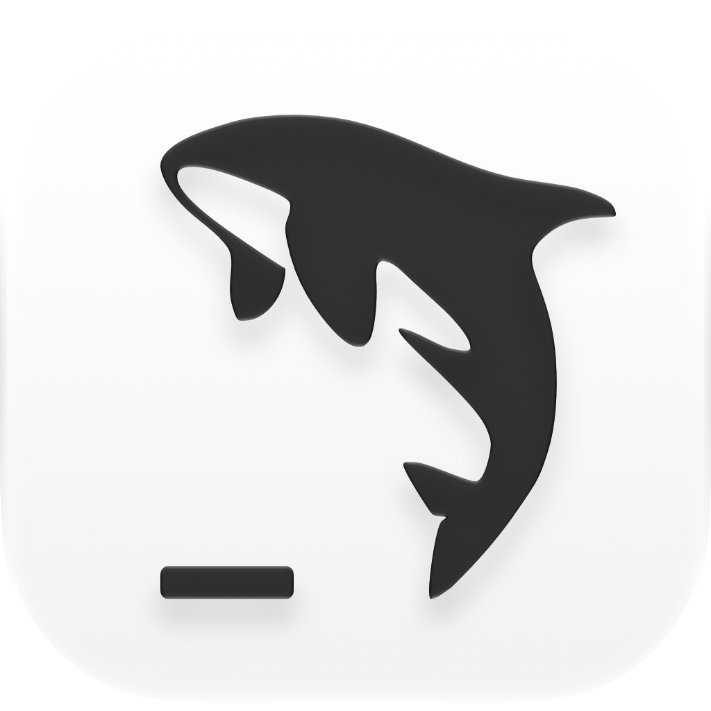
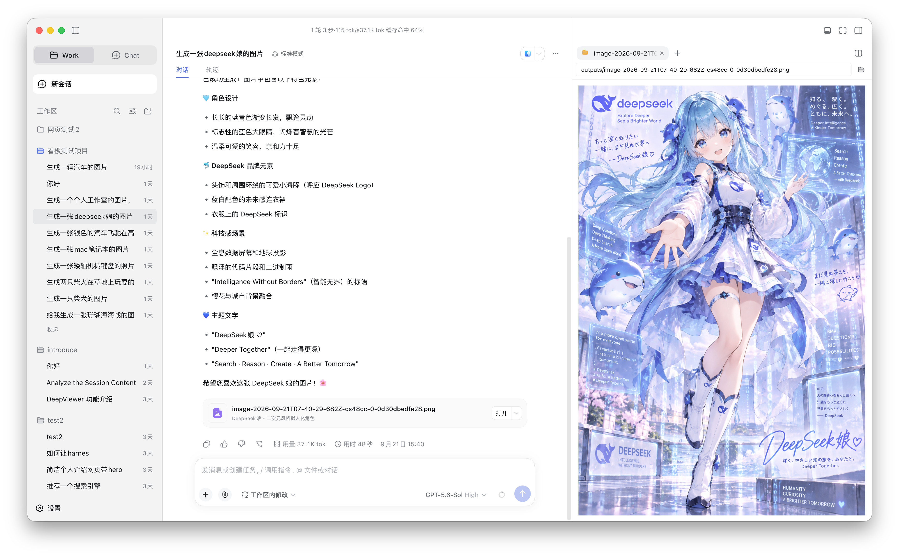
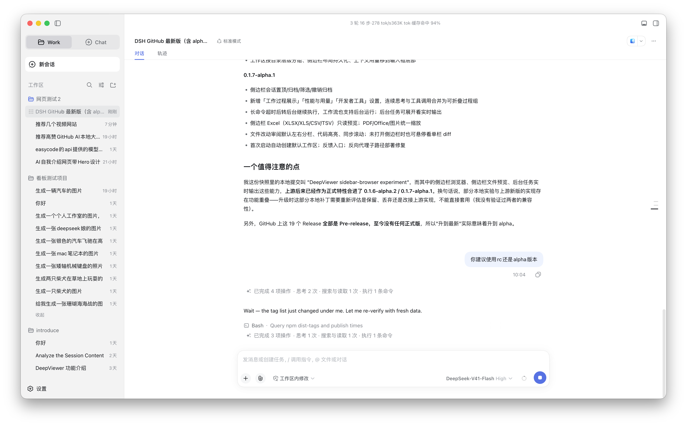
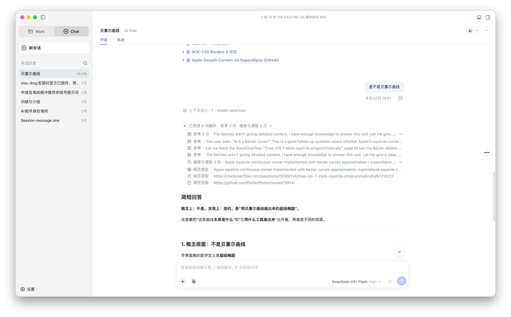
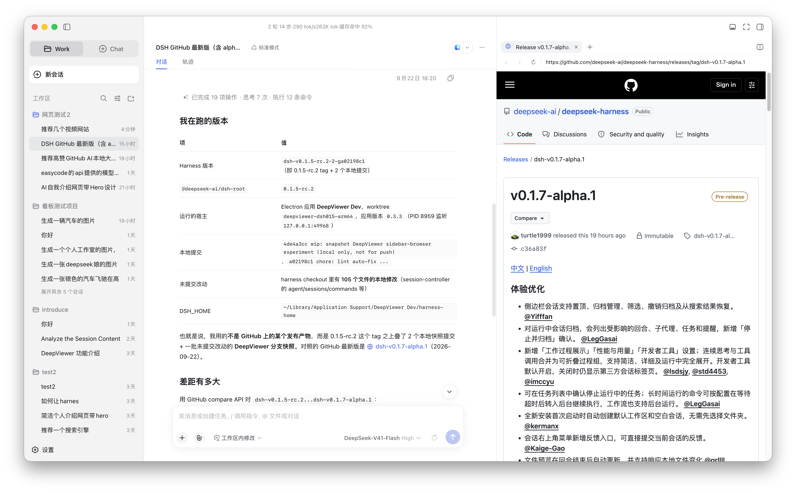
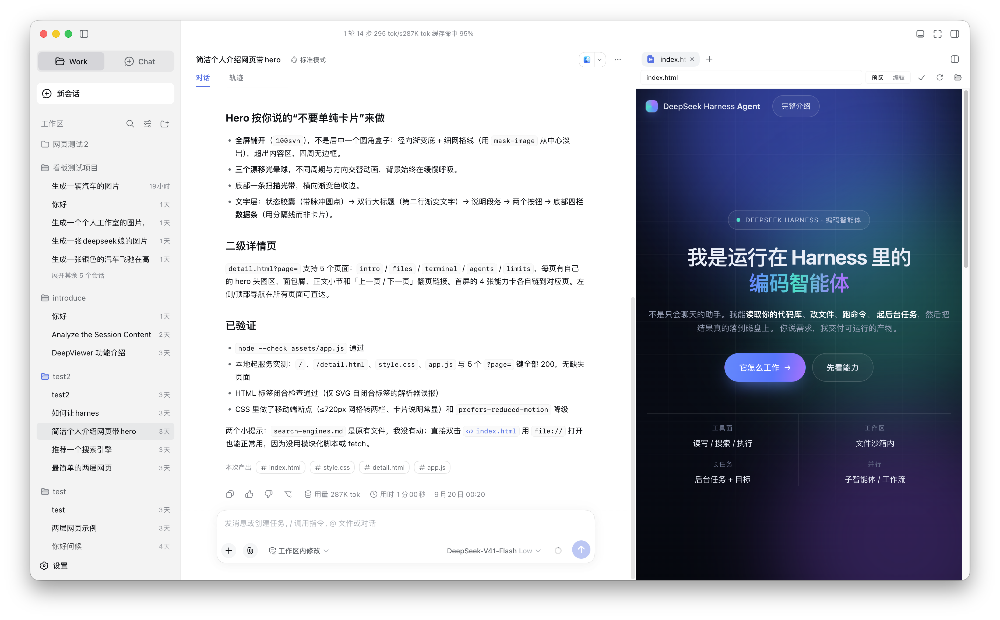
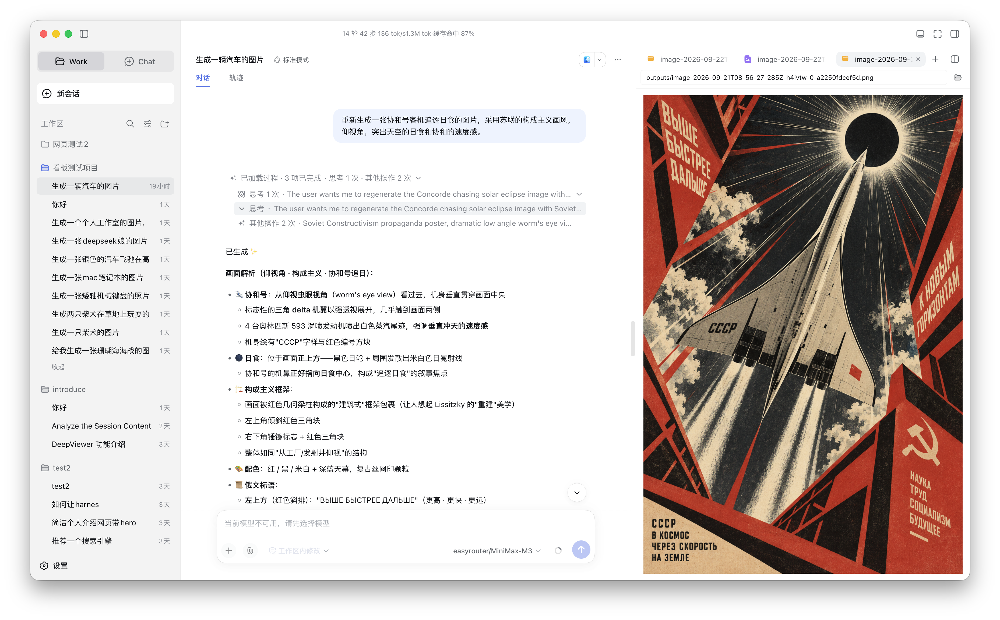
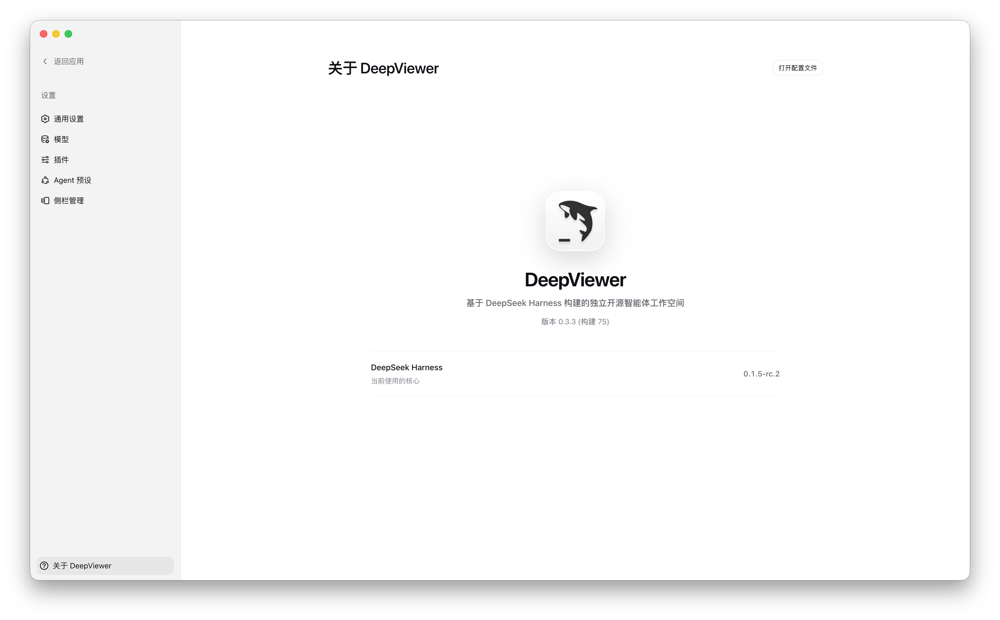

<p align="center">
  
</p>

<h1 align="center">DeepViewer</h1>

<p align="center">
  A visual, controllable, and customizable desktop workspace for DeepSeek Harness.
</p>

<p align="center">
  <a href="https://github.com/Duoasa/DeepViewer/releases"></a>
  <a href="https://github.com/Duoasa/DeepViewer/actions/workflows/ci.yml"></a>
  
  
  <a href="LICENSE"></a>
  <a href="https://github.com/deepseek-ai/deepseek-harness/discussions/2828"></a>
</p>

<p align="center">
  <a href="https://github.com/Duoasa/DeepViewer/releases/download/v0.5.1/DeepViewer-0.5.1-arm64.dmg"><strong>Download 0.5.1 (ARM64)</strong></a>
  ·
  <a href="#whats-new-in-051">What's new</a>
  ·
  <a href="#install-and-data">Privacy &amp; data</a>
  ·
  <a href="#build-from-source">Build from source</a>
</p>

<p align="center">
  <strong>English</strong> · <a href="README.zh-CN.md">简体中文</a>
</p>

DeepViewer is an independent, open-source desktop agent workspace built on
[DeepSeek Harness](https://github.com/deepseek-ai/deepseek-harness). It bundles
the pinned runtime into a macOS application with the native Electron
DesktopHost, Work and Chat spaces, file delivery, a sidebar workbench, and a
session map. The 0.5.0 source derives from Scoder 0.7.0 Build 43, restored to
DeepViewer's identity and independent data directories. Version 0.5.1 restores the earlier new-session animation and fixes the native macOS icon.

<p align="center">
  
</p>

> [!NOTE]
> DeepViewer is a community project. It is not affiliated with or endorsed by DeepSeek.

> [!IMPORTANT]
> The current release is **DeepViewer 0.5.1 / Build 91**, based on DeepSeek Harness `0.2.0-rc.2`, for **Apple Silicon arm64 only**. The freshly built DMG is Developer ID signed and Apple-notarized. Visual acceptance, real-account flows, and migrated sessions/settings/attachments remain separate manual checks.

> [!TIP]
> The [0.5.1 release](https://github.com/Duoasa/DeepViewer/releases/tag/v0.5.1) provides a [SHA-256 checksum list](https://github.com/Duoasa/DeepViewer/releases/download/v0.5.1/SHA256SUMS.txt). Installed and development data use separate, version-independent directories; back up existing data before a major upgrade. The previous [0.5.0 release](https://github.com/Duoasa/DeepViewer/releases/tag/v0.5.0), historical [0.3.3 / Build 75 release](https://github.com/Duoasa/DeepViewer/releases/tag/v0.3.3), with its SHA-256 checksum, and [0.2.5 release](https://github.com/Duoasa/DeepViewer/releases/tag/v0.2.5-preview.1) remain available.

> [!NOTE]
> All screenshots in this README are historical **0.3.3 / Build 75** references. They have not been replaced or used as evidence of the 0.5.1 interface or visual acceptance.

## What's new in 0.5.1

- Restore the previous release's new-session whale mark, cursor blink, spacing, text style, and centered idle layout while keeping the bottom composer resident and respecting reduced motion.
- Replace the full-bleed PNG Dock override with a native macOS icon compiled from the original whale vector. System-generated appearances, masks, transparent margins, and the legacy ICNS share one bundle identity.

See the [0.5.1 release record](docs/sdd/releases/v0.5.1.md) for build and package evidence. Actual new-session and Dock visual acceptance remains a manual check.

## The 0.5.0 migration from 0.3.3

| Area | Changes in 0.5.0 |
| --- | --- |
| Native desktop | Move from the previous custom shell and DSH 0.1.5 overlays to the official Electron/DesktopHost and pinned DSH `0.2.0-rc.2`, using Scoder `0.7.0 / Build 43` as the source baseline. |
| Work, Chat and session map | Retain workspace-backed Work and workspace-free Chat, and add the built-in Synapse session map for exploring session context. |
| Sidebar workbench | Harness native panels take over the standalone Better Sidebar activation. DeepViewer retains file/editor/Git workflows, session-relative paths, desktop browser integration, and permission checks. |
| Built-in modules | Bundle subscriptions `0.3.1` and model-capabilities `1.0.2` as application modules. Model-capabilities replaces the old reasoning plugin and carries over its supported settings. |
| Files and appearance | Keep attachment delivery and workspace previews, restore DeepViewer branding throughout the native shell, and follow desktop/system appearance. |
| Development stability | Ignore filesystem synchronization that only changes artifact metadata, preserving the mounted renderer. Real code changes and completed-build timestamps still trigger hot reload. |
| Upgrade continuity | Preserve separate stable/development data roots, snapshot the old DeepViewer kernel data before opening the new stores, and retain migration/rollback backups. Scoder and Saidex data are excluded from migration candidates. |
| Networking | Retain system proxy/PAC support, explicit proxy settings, scoped loopback/RPC authentication, and private-network permission boundaries. |

The standalone Better Sidebar and reasoning plugins are retired from activation; their replacement is part of this migration. Taskboard remains removed, and the historical preview plugin remains disabled. See the [0.5.0 release record](docs/sdd/releases/v0.5.0.md) for package evidence, the [specification](docs/sdd/specs/DV-0033-scoder-native-rebase/spec.md) for the manual verification boundary, and the [0.3.3 release record](docs/sdd/releases/v0.3.3.md) for historical evidence.

### Work, Chat, and process disclosure

Work groups sessions by project. Chat keeps conversations independent of a workspace. Both modes restore their history on startup, and related context, reasoning, searches, and operations appear in expandable summaries.





### Files and sidebar workbench

The sidebar can inspect workspace files, preview generated HTML, and browse pages alongside the conversation. File paths, panel navigation, and browser access are connected to the active desktop session.





### Generated images and attachments

Generated files are delivered as attachment cards with usable names and extensions. The same workspace copy opens in the sidebar preview, including images first produced outside the workspace.




### Appearance and version identity

Settings follow the desktop appearance, and the About page shows the app build and bundled Harness version.



## Install and data

1. Download [DeepViewer-0.5.1-arm64.dmg](https://github.com/Duoasa/DeepViewer/releases/download/v0.5.1/DeepViewer-0.5.1-arm64.dmg) and verify it against [SHA256SUMS.txt](https://github.com/Duoasa/DeepViewer/releases/download/v0.5.1/SHA256SUMS.txt) from the [0.5.1 release](https://github.com/Duoasa/DeepViewer/releases/tag/v0.5.1).
2. Open the DMG and copy `DeepViewer.app` to Applications.
3. Open the app and configure a provider or subscription. No global Node.js or Harness installation is needed.

DeepViewer binds its local service to a random loopback port. Installed app data lives in `~/Library/Application Support/DeepViewer`; development app data lives in `~/Library/Application Support/DeepViewer Dev`. Replacing the application does not replace these directories. Legacy data is copied and verified before first-use cutover; migration backups are retained. Keep your own backup before a major upgrade.

The 0.5.1 Build 91 installer is freshly built, Developer ID signed, and Apple-notarized. The bounded smoke suite passed 121 tests; package audit, integrity, and runtime evidence are recorded in the [0.5.1 release record](docs/sdd/releases/v0.5.1.md).

Office conversion may wait while scanning protected font directories in a real user profile; font permissions remain a manual check. This installer release does not publish the automatic-update feed.

## Open-source foundations and DeepViewer modifications

| Component | Source and license | What DeepViewer changes |
| --- | --- | --- |
| Core agent and native shell | [DeepSeek Harness](https://github.com/deepseek-ai/deepseek-harness), MIT, pinned to `639ed015397290b3745d163aafe02ffee4aa3f84` (`0.2.0-rc.2`) | Official Electron/DesktopHost with the [DeepViewer adapter](apps/deepviewer-adapter) and checked compatibility contracts. The agent loop remains upstream-owned. |
| Desktop source baseline | [Duoasa/scoder](https://github.com/Duoasa/scoder), `0.7.0 / Build 43`, pinned to `e277adc6ce512655095e6f65c63bdc72d24bae95`; original notices retained | Restore DeepViewer branding, package/update identities and data isolation, retain native features, and fix metadata-driven renderer replacement. Scoder's release history and user data are not imported. |
| Subscriptions and image tools | [V1ki/dsh-plugin-subscriptions](https://github.com/V1ki/dsh-plugin-subscriptions), MIT, `0.3.1` | Built-in DSH 0.2.0 compatibility module, scoped RPC/loopback checks, remaining-usage display, and image-generation status styling. |
| Sidebar provenance | [omdsh-dev/DSH-better-sidebar](https://github.com/omdsh-dev/DSH-better-sidebar), MIT | The standalone plugin is retired; Harness native panels take over the workbench. Attribution is retained for reused workflow code. |
| Model capabilities | [DeepViewer model-capabilities module](apps/dsh-plugin-model-capabilities), MIT, `1.0.2` | Provider/model scanning and reasoning/multimodal configuration, replacing the old `dsh-plugin-reasoning` activation while preserving supported settings. |
| Session map | [Vendored Synapse source](apps/deepviewer-adapter/workflows/vendor/synapse), with its original license and source record | Built-in session-map integration within the DeepViewer adapter. |

The historical first-party preview plugin is disabled in favor of the Harness preview. [dashi-taskboard](https://github.com/chuspeeism/dashi-taskboard) was evaluated and removed; no Taskboard runtime is bundled. Upstream copyrights and third-party licenses remain with their respective projects.

## Build from source

Requires macOS arm64, Node.js 24+, pnpm 11.19.0, and Xcode 26 or newer selected as the active developer toolchain. Apple `actool` compiles the native `.icon` source; it is required for development app builds and installers. The bootstrap checks out the pinned Harness source and applies the adapter's checked contracts; no user data or prebuilt app is needed.

```sh
git clone https://github.com/Duoasa/DeepViewer.git
cd DeepViewer
pnpm install --frozen-lockfile
node apps/deepviewer-desktop/scripts/bootstrap-native-upstream.mjs
pnpm --dir upstream/deepseek-harness install --frozen-lockfile
pnpm desktop:dev
```

`pnpm desktop:dev` builds and opens DeepViewer Dev using its separate profile. Use `pnpm desktop:dev:restart` to restart that project's development runner, or `pnpm desktop:build` to build without launching. Development builds increment the local build number.

Basic verification uses `pnpm typecheck` and `pnpm desktop:smoke`; native integration and adapter-contract checks are defined in the [CI workflow](.github/workflows/ci.yml). `pnpm desktop:preview` prepares a local preview. `pnpm desktop:release` prepares signed arm64 DMG/ZIP artifacts and requires `DEEPVIEWER_SIGN_IDENTITY`, `DEEPVIEWER_TEAM_ID`, and `DEEPVIEWER_NOTARY_PROFILE`; it does not publish them. Signing/notary credentials remain local, with the notary profile in the Keychain.

The [0.3.3 snapshot instructions](upstream/snapshots/v0.3.3/README.md) remain a historical reproduction guide for Build 75, not the build procedure for 0.5.0 or later.

The [SDD documents](docs/sdd/README.md) record architecture, plugin provenance, requirements, and verification. DeepViewer's original code uses the [MIT License](LICENSE); all upstream licenses remain applicable.

Report issues in [GitHub Issues](https://github.com/Duoasa/DeepViewer/issues). Please omit credentials, private files, and unredacted logs.
