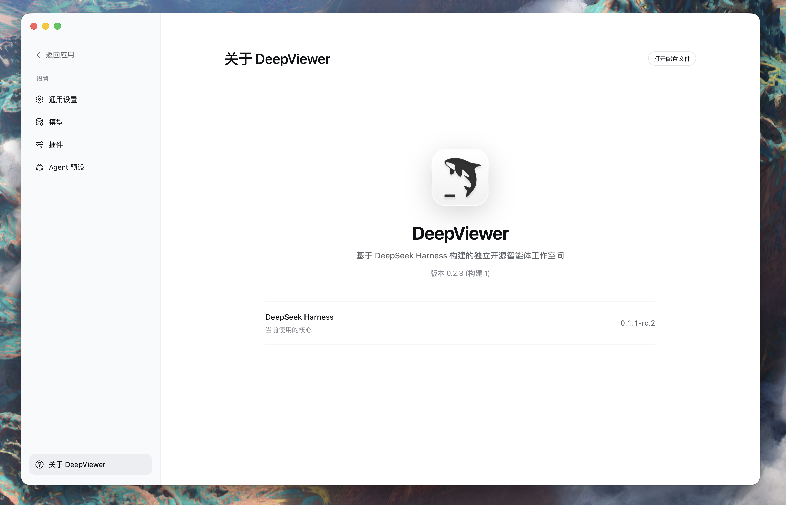
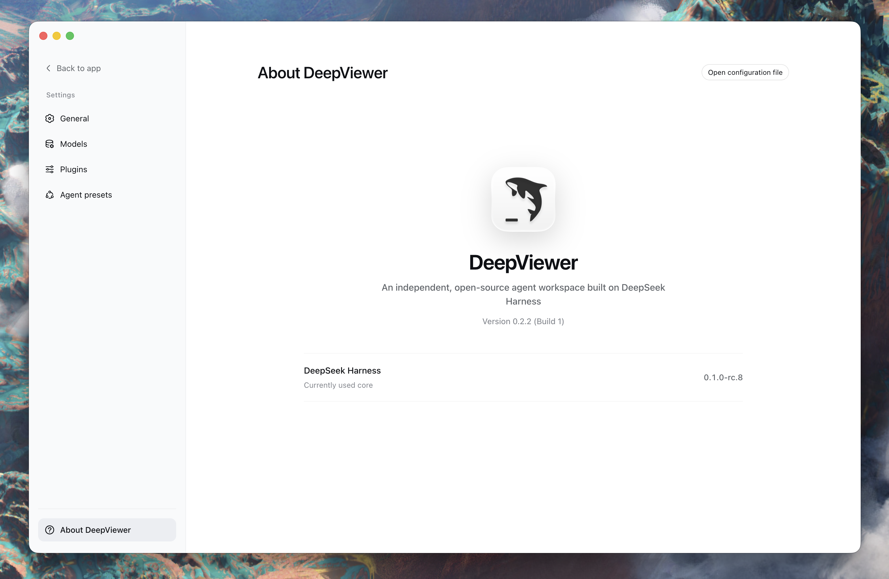

<p align="center">
  
</p>

<h1 align="center">DeepViewer</h1>

<p align="center">
  基于 DeepSeek Harness 的可视、可控、可定制桌面 Agent 工作台。
</p>

<p align="center">
  <a href="https://github.com/Duoasa/DeepViewer/releases"></a>
  <a href="https://github.com/Duoasa/DeepViewer/actions/workflows/ci.yml"></a>
  
  
  <a href="LICENSE"></a>
  <a href="https://github.com/deepseek-ai/deepseek-harness/discussions/2828"></a>
</p>

<p align="center">
  <a href="https://github.com/Duoasa/DeepViewer/releases/tag/v0.2.3"><strong>下载 DeepViewer 0.2.3</strong></a>
  ·
  <a href="#023-更新内容">0.2.3 更新内容</a>
  ·
  <a href="#隐私设计">隐私</a>
  ·
  <a href="#构建与测试">从源码构建</a>
</p>

<p align="center">
  <a href="README.md">English</a> · <strong>简体中文</strong>
</p>

DeepViewer 是一个建立在
[DeepSeek Harness](https://github.com/deepseek-ai/deepseek-harness) 之上的独立开源桌面
Agent 工作台。它把固定版本的本地 Runtime 封装进普通 macOS 应用，并提供面向可视、可控
Agent 体验设计的桌面外壳。

<p align="center">
  
</p>

> [!NOTE]
> DeepViewer 是独立社区项目，与 DeepSeek 没有从属或官方背书关系。

> [!CAUTION]
> 当前分支是仅提供源码的 `v0.2.4-preview.2` 灵动岛预览版，与已有安装包的
> `v0.2.3` 公开版隔离。它不提供应用包、DMG、签名、公证或稳定支持承诺；需要现成安装包的
> 用户请继续使用 `v0.2.3`。

> [!IMPORTANT]
> `v0.2.3` 是当前最新的 macOS 预览版（应用版本 `0.2.3`、构建号 `1`），内置
> DeepSeek Harness `0.1.1-rc.2`。本版完成两个内置插件与 rc.2 UI 契约适配，恢复独立的
> DeepViewer 图标和名称，并通过自动构建、隐私、签名、公证与发布门禁。订阅 PC-009 仍待
> 维护者人工复验，且本版仍属项目早期预览，并非稳定版本。

> [!TIP]
> DeepViewer 0.2.2 Build 2 继续保留为 rc.8 回滚版本。0.2.3 的 Apple Silicon 与 Intel
> 安装包均已完成 Developer ID 签名、Apple 公证和 ticket 装订，并分别公开发布。

## 0.2.4 源码预览版

`v0.2.4-preview.2` 在 `v0.2.3` / Harness rc.2 基线上把 QuotaView 同款单任务灵动岛无缝
集成到 DeepViewer 主顶栏。它只跟随当前选中的会话，设置页复用岛的真实 WebGL 粒子球与
波澜光晕，支持浅色/深色顶栏、固定对齐的会话 token 摘要和以中心为基准的收缩动画。透明岛
只跟随获得焦点的 DeepViewer 窗口，不再跨应用浮动；本版不包含多任务岛，也不增加第二套连接流程。

在 macOS 上使用 Node.js 24 和 pnpm 11.19.0 编译并运行源码预览版：

```sh
git clone --branch v0.2.4-preview.2 --depth 1 https://github.com/Duoasa/DeepViewer.git
cd DeepViewer
pnpm install --frozen-lockfile

git clone https://github.com/deepseek-ai/deepseek-harness upstream/deepseek-harness
git -C upstream/deepseek-harness checkout b150a551b8d465e31e418e1b2eaf5e79bbb7d28e
pnpm --dir upstream/deepseek-harness install --frozen-lockfile
pnpm --dir upstream/deepseek-harness run build:official
pnpm --dir upstream/deepseek-harness run release:pack --family vendor --out dist/deepviewer/vendor
pnpm --dir upstream/deepseek-harness run release:pack --family dsh --out dist/deepviewer/dsh

pnpm --filter @deepviewer/desktop runtime:arm64  # Apple Silicon
# pnpm --filter @deepviewer/desktop runtime:x64 # Intel Mac
pnpm desktop:dev
```

源码预览范围和冒烟证据见 [`DV-0016`](docs/sdd/specs/DV-0016-single-task-activity-island/spec.md)
与 [`v0.2.4-preview.2` 发布记录](docs/sdd/releases/v0.2.4-preview.2.md)。

## 为什么选择 DeepViewer

| | |
| --- | --- |
| **桌面优先** | 像普通 macOS 软件一样启动 Agent，无需手动执行 Node、npm、pnpm 或 Web UI 命令。 |
| **自包含 Runtime** | 应用内包含固定版本的 Harness Runtime 和兼容执行环境。 |
| **原生 Mac 安装包** | 分别提供 Apple Silicon arm64 与 Intel x64 安装包。 |
| **一体化 macOS 外壳** | 原生红绿灯位于应用内，顶部全宽可拖动，并提供 Codex 式完整侧栏收起。 |
| **默认本地运行** | Harness 只监听随机分配的 `127.0.0.1` 端口，不向局域网开放服务。 |
| **完整生命周期** | 桌面应用统一负责 Harness 的启动、健康检查、监控、重试和退出回收。 |
| **干净公开产物** | 每次公开发行均从 allowlist 输入重新构建，并阻止开发者路径、设置或凭据值进入包体。 |
| **规格驱动** | 产品目标、架构、实施任务和验证证据统一保存在版本化 SDD 系统中。 |

## 快速开始

1. 从 [0.2.3 Release](https://github.com/Duoasa/DeepViewer/releases/tag/v0.2.3)
   下载与你的 Mac 处理器匹配的版本。
2. 打开 DMG，将 `DeepViewer.app` 复制到“应用程序”。
3. 打开 DeepViewer。应用会自动启动内置 Harness，并在 Runtime 就绪后进入本地工作区。

| Mac | 下载 | SHA-256 |
| --- | --- | --- |
| Apple Silicon（`arm64`） | [下载 DMG](https://github.com/Duoasa/DeepViewer/releases/download/v0.2.3/DeepViewer-0.2.3-macos-arm64.dmg) | `4c86ca24958f74f9e049d5a97bb34cb51415724188065f8fdd501b6ca47b8adb` |
| Intel（`x64`） | [下载 DMG](https://github.com/Duoasa/DeepViewer/releases/download/v0.2.3/DeepViewer-0.2.3-macos-x64.dmg) | `1857891ae3b8a610656d7b6f77442e1aed6e7bfb6d5e57097c9b4669d552aec8` |

Release 同时提供
[`SHA256SUMS.txt`](https://github.com/Duoasa/DeepViewer/releases/download/v0.2.3/SHA256SUMS.txt)
供命令行核验。

## 0.2.3 更新内容

<p align="center">
  
</p>

- 将包内唯一核心固定到官方不可变 DeepSeek Harness `dsh-v0.1.1-rc.2` 标签
  （`b150a551b8d465e31e418e1b2eaf5e79bbb7d28e`）。
- 按 rc.2 Host、Client、provider、model、settings、preview 与降级契约，重新适配并验证
  `dsh-plugin-subscriptions@0.3.1` 和 `@deepviewer/dsh-plugin-preview@0.1.0`。
- 默认会话后端继续使用 JSONL，同时接入 rc.2 图片处理、Files API 复用、视觉模型约束、
  多问题输入、Markdown 宽表格和子代理标题导航。
- 适配 rc.2 新侧栏品牌契约：DeepViewer 图标与文本名称 `DeepViewer` 分别占用独立槽位，
  本地构建也不会回退成 DSH 鲸鱼与 `DSH Local Build`。
- 从 allowlist 输入独立生成 arm64/x64 Runtime 与 DMG；两个安装包均通过隐私审计、Developer
  ID 应用及 DMG 严格签名、Apple 公证、ticket 装订、Gatekeeper、磁盘镜像校验与只读挂载应用评估。

完整实现与验证范围见 [`DV-0015`](docs/sdd/specs/DV-0015-dsh-rc2-core-upgrade/spec.md) 与
[`0.2.3 发布记录`](docs/sdd/releases/v0.2.3.md)。DeepViewer 0.2.2 Build 2 继续保留为上一版
rc.8 回滚 Release。

## 0.2.2 更新内容

<p align="center">
  
</p>

### Build 2 浏览器启动热修复

- 阻止 rc.8 的 `dsh web` 默认行为在 DeepViewer 启动时额外打开系统浏览器，本地 Harness
  页面只由应用窗口加载。
- 核心、仅订阅、启用预览和纯核心降级路径全部固定传入 `--no-open`，不改变 loopback
  监听与桌面权限。
- 原 `v0.2.2` Build 1 Release 保持不变，作为回滚入口。

### DeepSeek Harness rc.8

- 将包内唯一核心升级为官方不可变 DeepSeek Harness `0.1.0-rc.8`
  （`141eb6fef83422698aef7a981029e843e8161534`）。
- 引入上游多模态与图片输入增强、文件/会话引用、可安装 Claude/Codex 子代理
  bundle、持久 PowerShell、并发 Web Search、子代理唤醒和启动/下载优化。
- 包含图片载荷、流式取消、自定义 OpenAI 兼容网关、搜索、工具显示和布局修复。

### 兼容与数据安全

- 按插件登记表重新验证 `dsh-plugin-subscriptions@0.3.1` 与
  `@deepviewer/dsh-plugin-preview@0.1.0`。预览插件已锁定 rc.8 peer，通过 rc.8
  host/client 契约构建，不扩大桌面文件系统或网络权限。
- DeepViewer 默认会话后端仍为 JSONL，普通 0.2.1 安装不执行存储迁移。rc.8 的可选
  SQLite 后端使用 schema 17，且不提供从早期预发布 schema 的迁移；自定义 SQLite
  用户应保留原数据库，为 rc.8 新建数据库，或重装 0.2.1 读取旧库。
- 继续保持签名包不可变、插件禁用/降级路径，并保留 0.2.1 Release 作为回滚入口。

### 发布质量

- arm64 与 x64 Runtime 均从官方 rc.8 release-pack 独立重建；每个应用只包含一个
  Harness 和相同的两个登记插件。
- 已执行上游官方完整构建、106 项桌面测试、TypeScript 与桌面 production build、
  包体隐私审计、严格 Developer ID 签名、Apple 公证、票据装订、Gatekeeper 与 DMG 校验。

完整资产与验证证据见 [`0.2.2 Build 2` 发布记录](docs/sdd/releases/v0.2.2-build.2.md)。
0.2.2 产品图记录 rc.8 的“关于”页面；维护者已验收的 0.2.1 对话与预览界面继续保留在
下方对应的版本历史中。

## 0.2.1 更新内容

<p align="center">
  
</p>

### DeepSeek Harness rc.7 与插件治理

- 包内唯一核心升级为 DeepSeek Harness `0.1.0-rc.7`；“关于 DeepViewer”会同时展示应用版本、
  Build 和当前 DSH 核心版本。
- 新增版本化 DSH 插件登记表。后续每次核心更新都必须逐一复核所有 Active 插件的来源、固定版本、
  peer 依赖、客户端注入点、能力、安全边界、降级行为和正式 Runtime。
- 已签名应用保持不可变：插件在构建时固定，运行时不会下载或修改
  `Contents/Resources/harness`。

### 模型页内的订阅能力

- 通过 DSH 官方 bundle/client 扩展点集成 `dsh-plugin-subscriptions@0.3.1`，不引入 DeepViewer
  私有模型协议。
- 模型页按“API”和“订阅”两个板块组织，中间使用设置页面通用分割线，不再占用独立菜单。
- 支持本地化的外部浏览器登录和提供方状态。用量条直接填充剩余额度，按健康/警告/危险三级
  阈值改变颜色，并使用不假定固定时长的“周期窗口”文案。
- 真实订阅账户登录已由维护者验证；由于外部服务并非稳定公共协议，模型/工具实际调用与登出
  继续作为显式兼容性检查项。

### 代码与静态网页预览

- 新增第一方 `@deepviewer/dsh-plugin-preview@0.1.0` 右侧栏，包含工作区文件树、只读代码高亮和
  隔离静态网页预览。
- 侧栏默认占当前窗口三分之一，可直接拖动边框调宽；固定在窗口右上角的开关会避让 macOS 安全区。
- 工作区文件可独立折叠，上下区域可拖动调整；基础浏览器工具栏提供后退、前进、刷新、受限地址
  跳转和系统浏览器打开。
- 预览只允许已登记工作区；路径穿越、符号链接逃逸、敏感文件、二进制、超限文件、过期 capability
  与任意开发服务器 URL 都会被拒绝。

### 更快的产出工作流与桌面体验

- Agent 生成的文件单击时默认在 DeepViewer 预览中打开；原生右键菜单增加“在 DeepViewer 中预览”、
  “在 Finder 中显示”和复制路径，同时保留原 Host 回退。
- 设置改为全窗口应用页面，使用稳定双列布局并加入“关于 DeepViewer”。
- 更新原生 SVG 品牌标志、欢迎内容、120px 启动图形、浅色/深色对比度，以及只允许手动操作的
  左右侧栏开关。

### 发布质量

- arm64 与 x64 Runtime 均从 rc.7 release-pack 独立构建；每个应用只包含一个 Harness 和相同的
  两个固定插件。
- 两个 DMG 均通过允许列表与凭据值隐私审计、嵌套代码严格签名、Apple 公证、票据装订、
  Gatekeeper、架构检查，以及上传后的独立 SHA-256 和 DMG 完整性复验。

完整资产与验证证据见 [`0.2.1` 发布记录](docs/sdd/releases/v0.2.1.md)。

## 0.1.2 更新内容

<p align="center">
  
  
</p>

- 将 macOS 窗口整理为侧栏和 Chat 两个视觉列，系统安全区进入对应列内部，不再形成独立的
  全宽顶栏。
- 把模型使用统计移动到 Chat 顶部安全区居中显示；新会话、思考、流式输出和完成状态的
  输入框统一固定在距离底部 32px 的基准位置。
- 新增以完整 Chat 画布为基准居中的欢迎内容：48px、50% 透明度的动画 DeepViewer 图形和
  本地化“让我们做点什么”文案。
- 精修侧栏内联品牌、聚焦时原生材质、失焦纯色、浅色/深色淡出连续性、固定侧栏按钮和
  原生窗口控件可读性。
- 增加可跟踪的上游 UI 覆盖与确定性同步/build 检查，以及隔离开发、ARM 本地预览和显式
  正式发布三个工作流层级。
- Build 2 新增受限的 HTTP(S) 系统浏览器跳转，并为本地交付物加入原生“在 Finder 中显示”
  和复制路径操作。
- 从允许列表输入重新构建彼此独立的 arm64 与 x64 DMG；两个安装包均完成 Developer ID
  签名、Apple 公证、票据装订和隐私审计，并发布可复现的 SHA-256 校验值。

完整资产与验证证据见 [`0.1.2` 发布记录](docs/sdd/releases/v0.1.2.md)和
[`v0.1.2-build.2` Release](https://github.com/Duoasa/DeepViewer/releases/tag/v0.1.2-build.2)。

## 0.1.1 更新内容

<p align="center">
  
</p>

- 将 macOS 原生红绿灯整合到应用内容区域，移除独立系统标题栏。
- 在红绿灯右侧加入 Codex 式侧栏按钮；收起时整个侧栏消失，原生全屏隐藏红绿灯后按钮
  自动补位到最左侧。
- 为整个主界面保留顶部全宽安全区，避免系统按钮、页面操作和拖动区域互相遮挡。
- 将应用名、窗口和 Dock 身份统一为 `DeepViewer`，使用维护者提供的 macOS 26 图标。
- 加入居中的 DeepViewer 启动等待页：Logo 横线像输入光标闪烁；插件加载阶段使用稳定
  Logo 与 `Loading Plugins...` 文字流光。
- 加入发布隐私门禁：每个公开架构均从干净 Runtime 和 allowlist staging 重建，DMG 创建前
  自动检查个人路径、设置与凭据值。
- 为 0.1.1 全新生成彼此独立的 arm64 与 x64 DMG；两个架构的安装包均完成 Developer ID
  签名并通过 Apple 公证。

## 当前限制

- x64 版本已通过架构、包体和 Apple Silicon + Rosetta 基础验证；真实 Intel Mac 验收仍待完成。
- 订阅提供方依赖外部非稳定协议；0.2.1 登录已人工验证，0.2.3 的登录、状态、实际模型/
  工具调用和登出完整流程仍需按提供方复验。
- DeepViewer 默认使用 JSONL，且不为自定义可选 SQLite 数据库提供迁移。自定义 SQLite 用户
  应保留旧数据库，单独验证新的 rc.2 数据库，或在改变存储配置前回滚。
- 预览浏览器只支持工作区静态站点，不支持任意 dev-server URL、编辑或完整通用浏览器能力。
- 本预览版不包含 Windows、自动更新、崩溃上报或稳定支持承诺。
- 当前 Runtime 优先保证完整性，DMG 体积较大；体积优化将在产品路径稳定后进行。

## 隐私设计

- Harness 仅监听系统随机分配的 loopback 地址。
- 桌面窗口拒绝非预期导航和新窗口。
- 桌面启动配置默认关闭 Harness 遥测。
- Renderer 只能使用允许列表内的桌面桥接能力，不获得通用 Shell 或文件系统访问权。
- 日志会脱敏常见 Authorization、API Key 配置和密钥形式的值。
- 公开安装包只从全新 allowlist staging 创建；构建会删除包管理器工作区元数据，并阻止
  开发机主目录、个人设置文件和当前环境凭据值进入包体。
- DeepViewer 不会把开发者或维护者本地的会话、工作区、日志、设置或 API 凭据加入公开资产。

## 使用要求

使用预构建应用：

- 配备 Apple Silicon 或 Intel 处理器的 Mac。
- 无需全局安装 Node.js、npm、pnpm 或 DeepSeek Harness。
- 建议使用 macOS 10.15 或更高版本，以走标准的 Developer ID 公证安装路径。

参与开发：

- Node.js 24 或更高版本。
- pnpm 11.19.0。
- 按下文准备固定版本的 DeepSeek Harness checkout。

## 构建与测试

```sh
git clone https://github.com/Duoasa/DeepViewer.git
cd DeepViewer
pnpm install

git clone https://github.com/deepseek-ai/deepseek-harness upstream/deepseek-harness
git -C upstream/deepseek-harness checkout b150a551b8d465e31e418e1b2eaf5e79bbb7d28e
pnpm --dir upstream/deepseek-harness install
pnpm --dir upstream/deepseek-harness run build:official
pnpm --dir upstream/deepseek-harness run release:pack --family vendor --out dist/deepviewer/vendor
pnpm --dir upstream/deepseek-harness run release:pack --family dsh --out dist/deepviewer/dsh

pnpm typecheck
pnpm test
pnpm desktop:build
```

GitHub Actions 会在每个 Pull Request 和 `main` 推送中执行冻结锁文件安装、类型检查、测试与
production build。工作流只有仓库只读权限，不会调用本地预览封包、正式封包、签名、公证或上传。

根据任务选择最轻量的显式迭代层级：

```sh
pnpm desktop:dev          # 构建、监听并重启独立的开发应用
pnpm desktop:dev:restart  # 请求当前开发 runner 重建并重启一次
pnpm desktop:preview      # 生成未签名的本地 arm64 DeepViewer Dev.app
pnpm desktop:release      # 重建、签名并公证双架构；不上传
```

开发与预览层使用隔离的 `DeepViewer Dev` 数据目录。除非维护者明确要求同步文档、本地验收包或
正式发布，日常迭代默认只修改代码并运行相关检查。GitHub Release 上传仍是需要单独授权的操作。

生成的应用、Runtime 和 DMG 位于 `out/` 与 `.runtime/`，它们属于构建产物，默认不会提交到 Git。

## 规格驱动开发

DeepViewer 的 [SDD 文档系统](docs/sdd/README.md) 是产品基线、架构、规格、任务、验证、
发布隐私规则和公开产物证据的事实来源。

## 许可证与上游

DeepViewer 原创代码采用 [MIT License](LICENSE) 开源。DeepSeek Harness 与第三方组件保留
各自的版权声明和许可证。当前桌面基线固定在 DeepSeek Harness 提交
`b150a551b8d465e31e418e1b2eaf5e79bbb7d28e`（`0.1.1-rc.2`）。

## 反馈

欢迎通过 [GitHub Issues](https://github.com/Duoasa/DeepViewer/issues) 提交问题、Intel 兼容性
结果和聚焦的功能建议。Issue 中不得包含 API Key、凭据、私有工作区内容或未脱敏日志。
